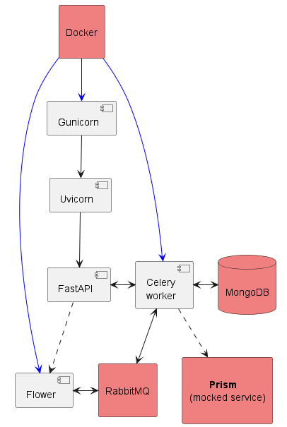

# fastapi-celery example
An elaborate python FastAPI example using Celery

## Author: Anders Wiklund

This code repository is an elaborate FAstAPI example of a RESTful API using Celery. There's also a response functionality where the callar can receive responses without have to poll for the answer. The caller can chose between  a http RESTful callback or a RabbitMQ queue message.

Async IO is a vital part of FastAPI, and it will be used where possible in this example.

This repository is described in a couple of **Medium** articles.

### Here's a brief outline of the article parts

#### [1. Introduction and installation of required components](https://medium.com/@wilde.consult/fastapi-celery-flower-docker-async-example-part1-8e1c6b631d51)
This part talks briefly about what Celery is and when to use it. It covers the overall 
architecture of the example and the installation of required components.

#### [2. A code walkthrough of configuration and tools components](https://medium.com/@wilde.consult/fastapi-celery-flower-docker-async-example-part2-3ef830974d7)
This part is a walkthrough of the code in the configuration and tools directories.

#### [3. A code walkthrough of API components](https://medium.com/@wilde.consult/fastapi-celery-flower-docker-async-example-part3-480dc92365ea)
This part is a walkthrough of the API code and design architecture file.

#### [4. A code walkthrough of main components testing](https://medium.com/@wilde.consult/fastapi-celery-flower-docker-async-example-part4-df654ea5070d)
This part is a walkthrough of the main parts in the FastAPI and Celery distributed task 
code, as well as the tests.

#### [5. How to run the development environment](https://medium.com/@wilde.consult/fastapi-celery-flower-docker-async-example-part5-9ce614db4747)
This part is a walkthrough of the development environment. I have developed this on Windows, 
but I also cover Linux and macOS differences where needed.

#### [6. How to create and run the Docker environment](https://medium.com/@wilde.consult/fastapi-celery-flower-docker-async-example-part6-3317181c9445)
This part is a walkthrough of the Docker local and prod environment. I have developed this 
on Windows, but I also cover Linux and macOS differences where needed. 
